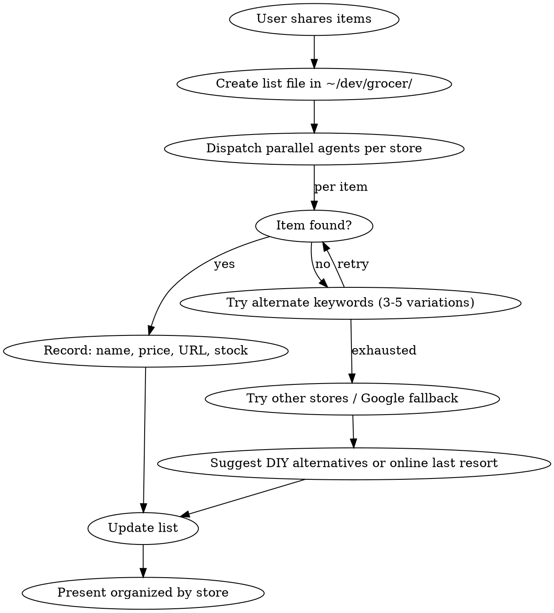

# Grocer — Local Store Product Finder

Browse real retailer websites via Playwright MCP to build shopping lists with actual prices, stock status, and clickable links. Prefer local stores over online — suggest Amazon/eBay only as last resort.

## Workflow



## Setup

1. Use `~/dev/grocer/` folder — create if missing
2. Create `{project}-list.md` with items, specs, and status
3. Dispatch **parallel Task agents per store** to avoid context bloat — each writes to `grocer/{store}-{item}.md`
4. Main session consolidates into the final list

## Browsing Retailers with Playwright MCP

**All Quebec retailers are JS-rendered — WebFetch returns empty HTML. MUST use Playwright MCP.**

### General Playwright Pattern

```
1. browser_navigate → store search URL
2. browser_snapshot → read search results
3. Extract: product name, price, URL, product code, stock status
4. browser_click → product page if needed for details
5. browser_snapshot → read product details
```

### Canac (canac.ca) — FRENCH ONLY

- **Search URL:** `https://www.canac.ca/canac/fr/2/search/TERMS`
- **Product URL:** `https://www.canac.ca/canac/fr/p/SLUG/CODE`
- English URLs redirect to homepage — ALWAYS use `/fr/`
- Search box: `browser_click` on search input, `browser_type` terms, submit
- Stock: look for "En inventaire" vs "Inventaire épuisé" per store
- Product codes visible in results — always record them
- Search terms: use French hardware terms (vis, boulon, mousse, goupille, tige)

### Home Depot (homedepot.ca)

- **Search URL:** `https://www.homedepot.ca/search?q=TERMS`
- Bilingual, works in English
- Good for: power tools, lumber, plumbing, electrical
- Stock shown per store location

### Canadian Tire (canadiantire.ca)

- Site can be finicky with Playwright — use Google fallback if needed
- **Google:** `site:canadiantire.ca SEARCH TERMS`
- Good for: automotive, seasonal, basic hardware

### Google as Fallback

When retailer search is poor:
- `"PRODUCT" site:RETAILER.ca` — find specific products
- `"PRODUCT" buy quebec city` — discover other local stores
- `"PRODUCT" canac OR "home depot" OR "canadian tire"` — cross-store search

### Dollarama / Dollar Stores

- No useful website for product search — must visit in-store
- Good for: craft foam, basic adhesives, simple hardware
- Note availability as "check in-store"

## Key Patterns

### Every product listing MUST include
- Product name (full, as shown on site)
- **Clickable URL** (full `https://` link — codes alone are useless)
- Price in CAD
- Stock status at user's local store
- Product code (for reference at store)

### Keyword Strategy — Try 3-5 Variations Per Item
1. French AND English terms (vis = screw, boulon = bolt, mousse = foam)
2. Technical AND common names (goupille cylindrique = dowel pin)
3. Imperial AND metric (M2 = 5/64", M4 = 5/32", 3mm ≈ #4 gauge)
4. Brand names if known
5. Google with `site:` as last resort

### Metric vs Imperial (Quebec stores stock mostly imperial)
| Metric | Imperial | Notes |
|--------|----------|-------|
| M2 | 5/64" | Very small, often specialty |
| M3 | 1/8" | Common |
| M4 | 5/32" | 8/32 screws (4.17mm) ≈ M4 — close enough for 3D prints |
| M5 | 3/16" | Common |
| 3mm shaft | #4 gauge | Wood screw sizing |

### When items aren't found locally
1. Try varied keywords (3-5 per item)
2. Search alternate local stores
3. **Suggest practical DIY alternatives** (often cheaper than shipping small parts)
4. Only suggest online as last resort — flag when shipping > item cost

### Parallel Agents for Throughput
- One Task agent per store or per item category
- Each agent writes results to `grocer/{store}-{item}.md`
- Main session reads results and consolidates
- **Agents share Playwright browser** — avoid running multiple browser agents simultaneously

## List File Format

```markdown
# Shopping List (DATE)

## Project: description

---

## BOUGHT
### Item Name — PURCHASED
- [**Product Name — price**](https://full-url)
  - Specs, notes

---

## STILL NEED — STORE NAME (location)
### Item Name
- **Spec:** detailed requirements
- [**Product — price** ✓ PICK THIS](https://full-url)
- [Alternative — price](https://full-url) (why it's backup)

---

## SUMMARY
| # | Item | Where | Price | Status |
|---|------|-------|-------|--------|
| 1 | Item | [Store](url) | $X.XX | BOUGHT/NEED/CONFIRMED |
```

## Common Mistakes
- Forgetting actual URLs (just listing product codes is useless to the user)
- Using English URLs on Canac (they redirect to homepage — always `/fr/`)
- Searching only one keyword variation (try 3-5 per item)
- Ordering small cheap parts online when a hardware store alternative exists
- Not converting metric to imperial for Quebec stores
- Using WebFetch on JS-rendered sites (always Playwright for retailers)
- Running multiple Playwright agents on same browser simultaneously
