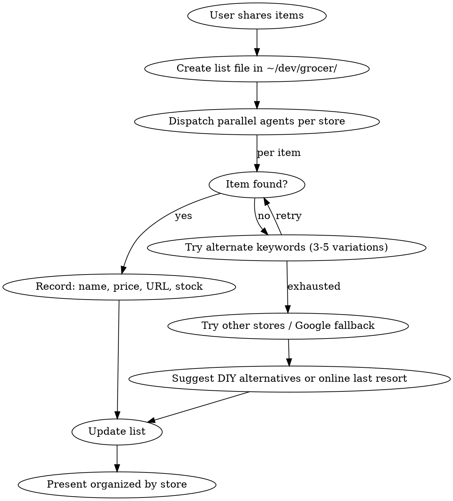

# Grocer — Local Store Product Finder

Browse real retailer websites via Playwright MCP to build shopping lists with actual prices, stock status, and clickable links. Prefer local stores over online.

## Workflow



## Setup

1. Use `~/dev/grocer/` folder — create if missing
2. Create `{project}-list.md` with items, specs, and status
3. Dispatch **parallel Task agents per store** to avoid context bloat — each writes to `grocer/{store}-{item}.md`
4. Main session consolidates into the final list

## Browsing Retailers with Playwright MCP

Most retailer sites are JS-rendered — WebFetch returns empty HTML. Use Playwright MCP.

```
1. browser_navigate → store search URL
2. browser_snapshot → read search results
3. Extract: product name, price, URL, product code, stock status
4. browser_click → product page if needed for details
5. browser_snapshot → read product details
```

If Playwright fails or site blocks automation, fall back to Google: `"PRODUCT" site:RETAILER.ca`

## Key Patterns

### Every product listing MUST include
- Product name (full, as shown on site)
- **Clickable URL** (full `https://` link — codes alone are useless)
- Price in local currency
- Stock status at user's local store
- Product code (for reference at store)

### Keyword Strategy — Try 3-5 Variations Per Item
1. Local language AND English terms
2. Technical AND common names
3. Imperial AND metric measurements
4. Brand names if known
5. Google with `site:` as last resort

### When items aren't found locally
1. Try varied keywords (3-5 per item)
2. Search alternate local stores
3. **Suggest practical DIY alternatives** (often cheaper than shipping small parts)
4. Only suggest online as last resort — flag when shipping > item cost

### Parallel Agents for Throughput
- One Task agent per store or per item category
- Each agent writes results to `grocer/{store}-{item}.md`
- Main session reads results and consolidates
- Avoid running multiple Playwright agents on the same browser simultaneously

## List File Format

```markdown
# Shopping List (DATE)

## Project: description

---

## BOUGHT
### Item Name — PURCHASED
- [**Product Name — price**](https://full-url)
  - Specs, notes

---

## STILL NEED — STORE NAME (location)
### Item Name
- **Spec:** detailed requirements
- [**Product — price** ✓ PICK THIS](https://full-url)
- [Alternative — price](https://full-url) (why it's backup)

---

## SUMMARY
| # | Item | Where | Price | Status |
|---|------|-------|-------|--------|
| 1 | Item | [Store](url) | $X.XX | BOUGHT/NEED/CONFIRMED |
```

## Common Mistakes
- Forgetting actual URLs (just listing product codes is useless)
- Searching only one keyword variation (try 3-5 per item)
- Ordering small cheap parts online when a hardware store alternative exists
- Using WebFetch on JS-rendered sites (use Playwright)
- Not converting between metric and imperial when needed
